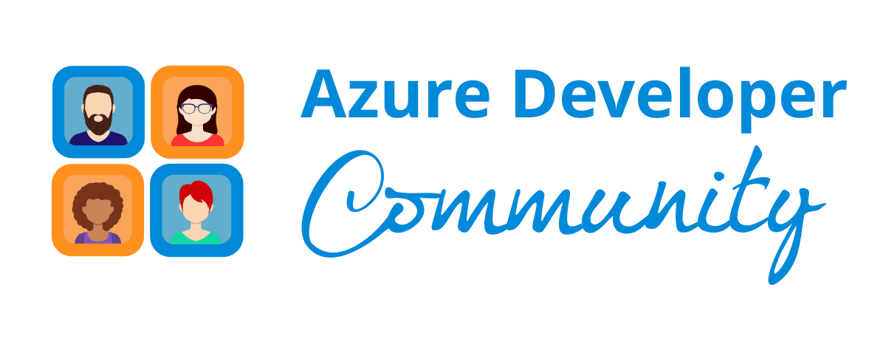

<h1>Azure AI Cohort :sparkles: </h1>
 
<table align="center" style="border: none;">
<td></td><td>&nbsp; </td> 
</table>

  <a href="#date"><strong>Date and Time</strong></a> ·
  <a href="#speakers"><strong>Speakers</strong></a> ·
  <a href="#assignment-submission"><strong>Assignment Submission</strong></a> ·
  <a href="#schedule"><strong>Schedule</strong></a> . 
  <a href="#organizers"><strong>Organizers</strong></a> 
  

  Welcome to the Azure AI Cohort, a virtual event dedicated to helping developers and AI enthusiasts harness the full potential of Microsoft Azure’s AI services. This cohort is designed for anyone looking to deepen their understanding of AI development and cloud integration using Azure’s powerful tools and frameworks.

Throughout this event, you’ll gain hands-on experience with Azure’s AI capabilities, including machine learning, cognitive services, and data analytics. Led by Azure experts, the sessions will guide you through real-world applications, best practices, and strategies for building and deploying intelligent solutions at scale.

Whether you’re an experienced developer or just starting with AI, the Azure AI Cohort offers the knowledge, tools, and resources needed to excel in AI-driven development on the Azure platform.

Join us and become part of a community exploring the future of AI on Azure!

# Date
 Date: 6 December - 28 December  
 Timing: 7:00 PM - 9:00 PM

# Speakers
Adithya Saladi &nbsp;  &nbsp;
 
Ajay Kumar S &nbsp; &nbsp;   &nbsp;
 

# Assignment Submission
[Microsoft Forms Submission](https://forms.office.com/r/MwtiC6U7Ju?origin=lprLink)

# Schedule
| Date          | Topic         | Resources     | Agenda         | 
| ------------- | ------------- | ------------- | ------------- |
| 06 December 2024 | Introduction to AI | [Day 1](https://github.com/TechHandbooks/azure-ai-cohort-day-1) | <pre>Overview of AI: Definition and history  Types of AI: Narrow vs. General AI, Machine Learning, Deep Learning Applications of AI: Real-world use cases in various industries Discussion: Ethical considerations in AI </pre> |
| 07 December 2024 | Fundamentals of Machine Learning | [Day 2](https://github.com/TechHandbooks/azure-ai-cohort-day-2) | <pre>Introduction to Machine Learning: Key concepts and terminology  Types of Machine Learning: Supervised, unsupervised, and reinforcement learning  Hands-On Activity: Building a simple machine learning model using Python and scikit-learn </pre> |
| 13 December 2024 | Data Preparation and Processing | [Day 3](https://github.com/TechHandbooks/azure-ai-cohort-day-3) | <pre>Importance of Data: Data collection, cleaning, and preprocessing Feature Engineering: Techniques for improving model performance Hands-On Activity: Data preprocess </pre> |
| 14 December 2024 | Deep Learning Basics | [Day 4](https://github.com/TechHandbooks/azure-ai-cohort-day-4) | <pre>What is Deep Learning?: Neural networks and their architecture Common Frameworks: Introduction to Azure Databricks and PyTorch Hands-On Activity: Building a simple neural network for image classification </pre> |
| 20 December 2024 | Natural Language Processing (NLP) | [Day 5](https://github.com/TechHandbooks/azure-ai-cohort-day-5) | <pre>Overview of NLP: Techniques and applications Key Concepts: Tokenization, embeddings, and language models Hands-On Activity: Text classification with Azure ML Service </pre> |
| 21 December 2024 | AI in Practice: Building a Mini Project | [Day 6](https://github.com/TechHandbooks/azure-ai-cohort-day-6) | <pre>Project Planning: Selecting a project idea and defining objectives Team Collaboration: Tools and practices for effective teamwork Hands-On Activity: Start working on the mini project (e.g., a chatbot, image recognizer) </pre> |
| 27 December 2024 | Model Evaluation and Optimization |  | <pre>Evaluation Metrics: Accuracy, precision, recall, F1-score, and ROC-AUC Hyperparameter Tuning: Techniques to optimize model performance Hands-On Activity: Evaluating and tuning the mini project modelI </pre> |
| 28 December 2024 | Future of AI and Career Paths |  | <pre>Emerging Trends: AI advancements and their implications Career Opportunities: Roles in AI and how to pursue them Final Project Presentations: Showcase mini projects and share learnings Q&A Session: Open discussion on AI topics of interest </pre> |

# Organizers
This event is organized by <a href="https://reskilll.com/">ReSkill</a> as part of <a href="https://azdev.reskilll.com/">Azure Developer Community</a>.
